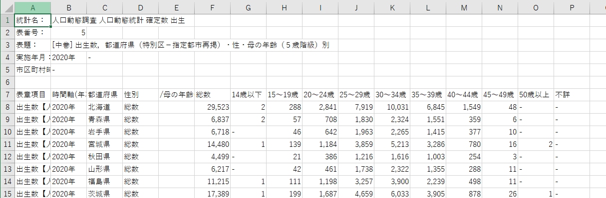

# pandas で政府統計データを使ってみよう：出産年齢のデータ分析

pandas で実際の政府統計データを使用して、分析を行います。
ここでは、厚生労働省が行っている「人口動態調査」のデータを用います。
その中の、「出生数，都道府県（特別区－指定都市再掲）・性・母の年齢（５歳階級）別」という統計から母親の出産年齢の傾向を見てみます。

- 政府統計データのダウンロード
- データの読み込み
- データの前処理
- データ分析

## データのダウンロード

政府統計データをダウンロードする場合、e-Stat を使うのが便利です。
e-Stat は、政府統計のデータをまとめているウェブサイトで、数年分の調査結果を一括で出力できるなど、便利な機能があります。

以下の URL から統計データをダウンロードします。

<https://www.e-stat.go.jp/dbview?sid=0003411631>

> [!TIP]
> 政府統計データにどのようなものがあるかは、e-Stat や、デジタル庁が運営しているデータカタログサイトなどで調べてみましょう。
>
> - e-Stat: <https://www.e-stat.go.jp>
> - データカタログサイト：<https://www.data.go.jp/?lang=ja>

## ファイル構成

データは `data/raw` ディレクトリに保存します。
データ名は `maternal_age.csv` とします。
今回作成するスクリプトは `maternal_age` というディレクトリ内の `analysis.py` というファイルに書き込むとします。
ファイル構成は次のような想定です。

```bash
.
├── data
│   └── raw
│        └── maternal_age.csv
└── src
   └── maternal_age
       └── analysis.py
```

`analysis.py` にやることを書いておきましょう。

```python
# データを読み込む

# データの前処理

# データ分析
```

データを Python で読み込む前に、エクセルやメモ帳、VSCode などで開いてみましょう。



ここから、次のことがまず分かります。

- データは 7 行目から記載されている
- 値が 0 件の部分は欠損値 `-` に置き換えられている
- 千単位で数値が `,` で区切られている
- 年数には `年` の文字列が含まれている
- 「都道府県（特別区－指定都市再掲）」など、列名としては使いづらいのがある
- 「 /母の年齢(5歳階級)」などの分析には不必要な列がある

データの読み込み・分析の際には、これらのことに留意する必要があります。

## データ読み込み

`pandas` を用いてデータを読み込みます。
`read_csv` 関数の `skiprows` は何行目からをデータとして読み込むのかを指定できます。
Python では 0 から数えるので、6 を指定します。
`na_values` で欠損値として扱う文字列 `-` を追加します。
`thousands` で千単位の区切り文字として使用されている `,` を指定します。

```python
import pandas as pd

def main():
    # データを読み込む
    DATA_PATH = "data/raw/maternal_age.csv"
    df = pd.read_csv(DATA_PATH, skiprows=6, na_values="-", thousands=",")
    print(df.head())

    # データの前処理

    # データ分析

if __name__ == "__main__":
    main()
```

スクリプトを実行します。

```bash
python3 src/maternal_age/analysis.py
     表章項目 時間軸(年次) 都道府県（特別区－指定都市再掲）  性別  /母の年齢(5歳階級)     総数  14歳以下  15～19歳  20～24歳  25～29歳  30～34歳  35～39歳  40～44歳  45～49歳  50歳以上  不詳
0  出生数【人】   2020年              北海道  総数          NaN  29523    2.0     288    2841    7919   10031    6845    1549      48    NaN NaN
1  出生数【人】   2020年              青森県  総数          NaN   6837    2.0      57     708    1830    2324    1551     359       6    NaN NaN
2  出生数【人】   2020年              岩手県  総数          NaN   6718    NaN      46     642    1963    2265    1415     377      10    NaN NaN
3  出生数【人】   2020年              宮城県  総数          NaN  14480    1.0     139    1184    3859    5213    3286     780      16    2.0 NaN
4  出生数【人】   2020年              秋田県  総数          NaN   4499    NaN      21     386    1216    1616    1003     254       3    NaN NaN
```

上手く読み込めています。

## データの前処理

データは上手く読み込めましたが、このままでは欠損値が上手く処理していなかったり、列名が長すぎるものがあるなど、問題があります。
データ分析が上手くできるために、データの前処理をする必要があります。

### 不要な列を削除する

「 /母の年齢(5歳階級)」などは必要ないため、データから除外します。
この例では、（年齢）不詳の列もほとんど欠損値のため除外します。
列の除外には `drop` メソッドを使用します。
`main` 関数の内容を書き換えます。

```python
def main():
    # データを読み込む
    DATA_PATH = "data/raw/maternal_age.csv"
    df = pd.read_csv(DATA_PATH, skiprows=6)

    # データの前処理

    # 不要な列の削除
    df = df.drop(columns=[
        "表章項目",
        "性別",
        "/母の年齢(5歳階級)",
        "不詳",
    ])
    print(df.columns)

    # データ分析
```

```bash
python3 src/maternal_age/analysis.py
Index(['時間軸(年次)', '都道府県（特別区－指定都市再掲）', '総数', '14歳以下', '15～19歳', '20～24歳', '25～29歳', '30～34歳', '35～39歳', '40～44歳', '45～49歳', '50歳以上'], dtype='object')
```

### 列名を変更する

都道府県の列を見るのに、「都道府県（特別区－指定都市再掲）」とタイプするのはさすがに面倒ですし、エラーの温床にもなります。
列名を英語に変更しましょう。
`rename` メソッドを使用します。
`main` 関数に以下を追加します。

```python

    # 列名の変更
    df = df.rename(
        columns={
            "時間軸(年次)": "year",
            "都道府県（特別区－指定都市再掲）": "prefecture",
            "総数": "num",
            "14歳以下": "age_below_14",
            "15～19歳": "age_between_15_19",
            "20～24歳": "age_between_20_24",
            "25～29歳": "age_between_25_29",
            "30～34歳": "age_between_30_34",
            "35～39歳": "age_between_35_39",
            "40～44歳": "age_between_40_44",
            "45～49歳": "age_between_45_49",
            "50歳以上": "age_over_50",
        }
    )

    print(df.columns)
    # データ分析
```

`時間軸(年次)` は半角かっこ、`都道府県（特別区－指定都市再掲）` では全角かっこなことに注意してください。

> [!TIP]
> かっこが半角か全角か `columns` などでチェックしておきましょう。

列名が変更されていることを確認します。

```bash
python3 src/maternal_age/analysis.py
Index(['year', 'prefecture', 'num', 'age_below_14', 'age_between_15_19',
       'age_between_20_24', 'age_between_25_29', 'age_between_30_34',
       'age_between_35_39', 'age_between_40_44', 'age_between_45_49',
       'age_over_50'],
      dtype='object')
```

### 欠損値の穴埋めをする

このデータでは、欠損値は 0 を意味しています。
`fillna` メソッドを使用します。
`main` 関数に以下を追加します。

```python
    # 欠損値の穴埋め
    df = df.fillna(value=0)

    print(df.head())
```

欠損値が 0 になっていることを確認します。

```bash
python3 src/maternal_age/analysis.py
    year prefecture    num  age_below_14  age_between_15_19  age_between_20_24  age_between_25_29  age_between_30_34  age_between_35_39  age_between_40_44  age_between_45_49  age_over_50
0  2020年        北海道  29523           2.0                288               2841               7919              10031               6845               1549                 48          0.0
1  2020年        青森県   6837           2.0                 57                708               1830               2324               1551                359                  6          0.0
2  2020年        岩手県   6718           0.0                 46                642               1963               2265               1415                377                 10          0.0
3  2020年        宮城県  14480           1.0                139               1184               3859               5213               3286                780                 16          2.0
4  2020年        秋田県   4499           0.0                 21                386               1216               1616               1003                254                  3          0.0
```

### 年を整数型に変更する

`2020年` という文字列は使い勝手が悪いので、`2020` というように `year` を整数型に変更します。
`年` は `str` アクセサの `replace` メソッドで削除します。
`main` 関数に次を追加します。

```python
    # 年を整数型に変更する
    df.year = df.year.str.replace("年", "")

    print(df.year.head())
```

年の文字が上手く削除されていることを確認します。

```bash
python3 src/maternal_age/analysis.py
0    2020
1    2020
2    2020
3    2020
4    2020
Name: year, dtype: object
```

ただ、`dtype: object` とあるように、`year` はまだ整数型に変換されていません。
`astype` メソッドでデータ型を変更します。
`main` 関数を修正します。

```python
    # 年を整数型に変更する
    df.year = df.year.str.replace("年", "").astype(int)

    print(df.year.head())
```

整数型に変更されたのを確認します。

```python
python3 src/maternal_age/analysis.py
0    2020
1    2020
2    2020
3    2020
4    2020
Name: year, dtype: int64
```

`dtype` が `int64` に変更されています。

### 高齢出産率を計算する

ここでは、高齢出産 (35 歳以上の出産) が 20 歳以上の出産数と比べて増加しているかを分析します。
列ごとに、高齢出産数・率を計算します。
複数の列を `sum` メソッドで合計した結果を新たな列として追加します。
`main` 関数に以下を追加します。

```python
    # 高齢出産数・率を計算する
    df["normal_birth"] = df[
        [
            "age_between_20_24",
            "age_between_25_29",
            "age_between_30_34",
        ]
    ].sum(axis=1)

    df["late_birth"] = df[
        [
            "age_between_35_39",
            "age_between_40_44",
            "age_between_45_49",
            "age_over_50",
        ]
    ].sum(axis=1)

    df["late_birth_rate"] = df["late_birth"] / (
        df["normal_birth"] + df["late_birth"]
    )

    print(df.head())
```

行毎で足し上げるので、`sum(axis=1)` とすることを忘れないで下さい。

```bash
 python3 src/maternal_age/analysis.py
   year prefecture    num  age_below_14  age_between_15_19  ...  age_between_45_49  age_over_50  normal_birth  late_birth  late_birth_rate
0  2020        北海道  29523           2.0                288  ...                 48          0.0         20791      8442.0         0.288783
1  2020        青森県   6837           2.0                 57  ...                  6          0.0          4862      1916.0         0.282679
2  2020        岩手県   6718           0.0                 46  ...                 10          0.0          4870      1802.0         0.270084
3  2020        宮城県  14480           1.0                139  ...                 16          2.0         10256      4084.0         0.284798
4  2020        秋田県   4499           0.0                 21  ...                  3          0.0          3218      1260.0         0.281376
```

## データ分析

これで、都道府県 x 年のパネルデータを扱う準備ができました。

> [!NOTE]
> 同じ期間内での複数の都道府県や人・企業などのデータをクロスセクションデータ、同じ都道府県や人・企業などを複数の期間で追ったものを時系列データといいます。
> 複数の期間で複数の都道府県や人・企業を追ったデータをパネルデータと呼びます。

ここでは、2 つの分析を行います。

- 高齢出産率の年別平均の計算
- 高齢出産率の都道府県ランクの計算

その前に、記述統計量を確認しましょう。

### 記述統計

`describe` メソッドで記述統計量を計算します。
`main` 関数に以下を追加します。

```python
    # 記述統計
    print(df["late_birth_rate"].describe())
```

```bash
python3 src/maternal_age/analysis.py
count    282.000000
mean       0.272821
std        0.023943
min        0.227689
25%        0.256795
50%        0.269063
75%        0.283513
max        0.374096
Name: late_birth_rate, dtype: float64
```

高齢出産率は 5 年間、47 都道府県のデータにおいて、高齢出産率は平均して 約 27.2% と少なくない数であることがわかります。
また、75% のパーセンタイルは 28.3% であることに比べ、最大値は 37.47% と 10パーセンテージ近く高いことも分かります。

### 高齢出産率の年別平均

高齢出産率が年が上がるごとに増えつつあるのか、確認してみます。
年別の平均値を計算します。
`groupby` メソッドを用いて、`DataFrame` を年別でまとめます。
`mean` メソッドで平均を計算し、`late_birth_rate` のみの結果を取り出します。
`main` 関数に以下を追加します。

```python
    # 年別平均
    mean_by_year = df.groupby('year').mean()["late_birth_rate"]
    print(mean_by_year)
```

> [!TIP]
> `late_birth_rate` のみを呼び出した後に `mean` メソッドで平均を計算することもできます。
> つまり、`df.groupby('year')["late_birth_rate"].mean()` でも可能です。

```bash
python3 src/maternal_age/analysis.py
~~~
year
2015    0.264842
2016    0.269567
2017    0.271851
2018    0.273072
2019    0.277304
2020    0.280291
Name: late_birth_rate, dtype: float64
```

2015 年から 2020 年にかけて少しずつ高齢出産率が上昇していることが分かります。

### 高齢出産率の都道府県ランク

5 年間の平均の高齢出産率はどの都道府県が高いのかを順位付けしてみます。
都道府県別の 5 年間の平均は先ほどと同じように `groupby` メソッドを用いて都道府県別にまとめ、`mean` メソッドで平均を計算し、`late_birth_rate` のみを取り出します。
順位の列をつけたいため、`late_birth_rate` の結果を `Series` ではなく `DataFrame` として取り出します。

> [!NOTE]
> `df[late_birth_rate]` は `Series`、`df[[late_birth_rate]]` は `DataFrame` が返ってきます。
> また、`df[late_birth_rate].to_frame()` で `Series` を `DataFrame` に変換することも可能です。

順位付けには、`rank` メソッドを用います。
ここでは、`ascending=False` にして、高い順から並べます。
結果を `prefecture_rank` 列として追加します。
また、出力が見やすいように `sort_values` メソッドで値を並び変えます。
`by` でどの列の値を元に並び変えるのかを指定します。
ここでは、`prefecture_rank` で値を並び変えます。
順位が高い 5 つと順位が低い 5 つのみを取り出します。
`main` 関数に以下を追加します。

```python
    # 都道府県ランク
    mean_by_prefecture = df.groupby("prefecture")[["late_birth_rate"]].mean()
    mean_by_prefecture["prefecture_rank"] = mean_by_prefecture.rank(
        ascending=False
    )
    mean_by_prefecture = mean_by_prefecture.sort_values(by="prefecture_rank")
    print("\ntop 5")
    print(mean_by_prefecture.head())
    print("\nbottom 5")
    print(mean_by_prefecture.tail())
```

```bash
python3 src/maternal_age/analysis.py
~~~
top 5
            late_birth_rate  prefecture_rank
prefecture                                  
東京都                0.369605              1.0
神奈川県               0.328828              2.0
京都府                0.312285              3.0
千葉県                0.299364              4.0
埼玉県                0.296015              5.0

bottom 5
            late_birth_rate  prefecture_rank
prefecture                                  
宮崎県                0.250071             43.0
佐賀県                0.249329             44.0
和歌山県               0.248906             45.0
山口県                0.247753             46.0
福島県                0.236949             47.0
```

高齢出産率が最も高いのは東京都、その次に神奈川県であることがわかりました。
逆に、最も低いのは福島県、その次に山口県です。
ここから、人口密度との関連などが仮説として考えられそうです。
